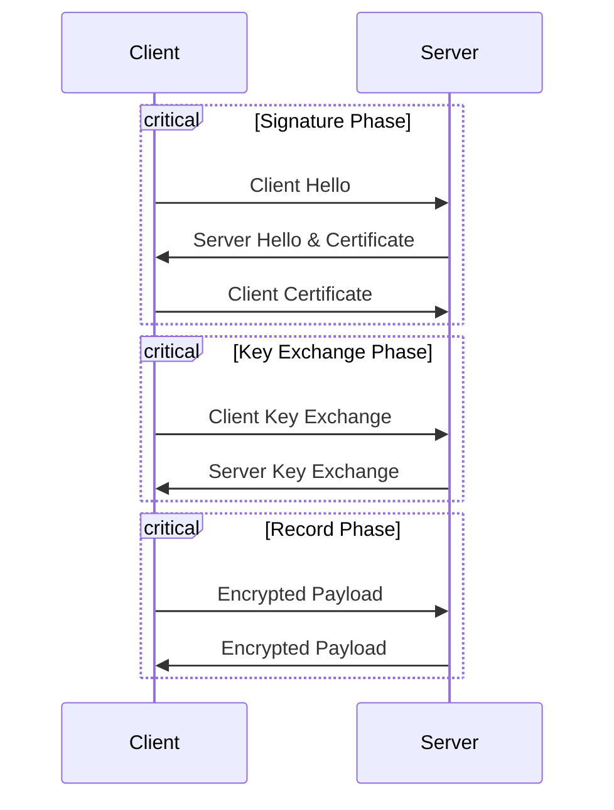

> 密码学(Cryptography)是使用**加解密、单向散列、消息认证码、数字签名**等技术，确保数据在存储、传输等过程中的**机密性Confidentiality、完整性Integrity、认证性Authentication、不可否认性Non-repudiation**的一门科学，其结合了数学、计算机科学、电子与通信等多学科的知识。

## Primitive（原语）

### 加解密（Encryption and Decryption）

> 密码系统：密码算法+密钥，密码算法是公开的，密钥才需要保密[^1]，解决的是**机密性Confidentiality**问题。  
  - 密码算法：常用的对称密码算法有AES、非对称密码算法有RSA。  
  - 密钥：密钥(key)就是一个巨大的数字，衡量一个密钥的强度需要看其密钥空间的大小，即可能出现的密钥的总数量，密钥空间的大小是由密钥长度决定的。

#### 对称密码学(Symmetric Cryptography)

数据发送方和接收方使用相同的密钥——**对称密钥**（加密密钥=解密密钥）、使用**对称加解密算法**进行通信。  
对称密钥需要保密，因为如果对称密钥泄露，窃听者就可以对密文进行解密，所以面临着密钥配送难题。

对称密钥生成的3种常用方法：
1. 随机数生成器：有硬件随机数（真随机数）生成器和软件随机数（伪随机数）生成器。一般情况下，均是使用软件随机数，但需要注意密码学用途的伪随机数生成器必须是专门针对密码学用途而设计的，即一定要具备**不可预测性**这一性质。
2. 密钥派生函数：利用现有的密码（如用户的密码）或其他形式的秘密信息，通过一个密码学安全的函数来派生出密钥。常用的KDF包括PBKDF2、bcrypt、scrypt和Argon2等。
3. 基于协议的密钥交换：如Diffie-Hellman密钥交换、椭圆曲线Diffie-Hellman密钥交换（ECDH）协议等。

密钥配送难题的解决方案（3、4较为常用）：
1. 通过事先共享密钥来解决；
2. 通过密钥分配中心来解决；
3. 通过Diffie-Hellman密钥交换来解决：在进行加密通信的双方传递一些非秘密信息，即可以协商出相同的对称密钥。该协议的安全性基于离散对数问题的计算复杂性（需要注意的是，Diffie-Hellman 本身是基于非对称密码学原理设计的，因为它涉及到公钥和私钥的概念：每个参与者都有自己的私钥和对应的公钥。但最终的结果是一个共享的对称密钥，而不是一对非对称密钥）；
4. 通过非对称密码学来解决：使用公钥加密对称密钥，配送的是对称密钥的密文，只有拥有私钥（接收者本人）的人才能解密得到对称密钥；

#### 非对称密码（公钥密码）学(Asymmetric Cryptography)

数据发送方和接收方使用不同的密钥——**非对称密钥**（加密密钥=公钥、解密密钥=私钥）、使用**非对称加解密算法**进行通信。    

- 消息发送方A：使用**消息接收方B的公钥**对消息进行加密，将加密后的消息发送给接收方B；
- 消息接收方B：用**自己的私钥**对收到的密文进行解密得到消息明文。

只有私钥（解密密钥）需要保密，因为只有拥有私钥的人才能对密文进行解密，公钥是无法解密的，所以没有密钥配送难题。

但非对称密码又有2个问题：
1. 难以抵御中间人攻击：攻击者混入发送者和接收者中间，拦截后替换双方公钥，对发送者伪装成接收者，对接收者伪装成发送者。需要采用数字证书（对公钥加上数字签名）技术解决，确保公钥属于真正的**消息接收方**。
2. 处理速度远远低于对称密码：使用混合密码系统解决，非对称密码（公钥）只用来加密对称密钥，然后接收方使用私钥解密，得到对称密钥后使用对称加密算法对消息进行加密后传输，兼顾保密与性能。

密钥生成：生成非对称密钥（即公钥和私钥对）的方法主要依赖于所选择的公钥加密算法，生成的一组对应的密钥对（公钥+私钥）。如：RSA算法、ECC椭圆曲线算法等。

### 单向散列（Hash, 哈希）函数

单向散列函数是一种将长消息转换为短散列值的技术，用于确保消息的**完整性(Integrity)**。
- 消息不同散列值也不同，具有抗碰撞性（collision resistance）；
- 所使用的单向散列函数决定了散列值的长度，和消息本身的长度无关；如SHA-256，其计算出来的散列值长度永远是256bit（即32bytes）。

## Schema（方法）

### 消息认证码（Message Authentication Code）

消息认证码是一种能确认**完整性Integrity并进行认证Authentication**的技术。它的输入包括任意长度的消息和一个发送者与接收者之间共享的对称密钥，输出固定长度的数据，称为MAC值。可以理解为一种与密钥相关联的单向散列函数[^2]。
- 消息中哪怕发生1bit的变化，MAC值也会发生变化 —— 完整性
- 只有拥有密钥才能计算/验证MAC值 —— 认证

消息认证码无法解决的问题（原因：因为是对称密钥，通信双方对同一份消息均可以加密、解密，所以可以互相伪造；解决方法：数字签名技术）：
1. 只能在收发双方间进行认证，无法向第三方证明
2. 无法防止否认

### 数字签名（Digital Signature）

数字签名是一种能够对第三方进行消息认证，并能够防止通信双方做出否认的技术。它解决了**完整性(Integrity)、认证性(Authentication)、不可否认性(Non-repudiation)**。
- 消息发送方A：计算消息的散列值，然后使用**自己的私钥**对散列值进行加密，生成此份消息的数字签名，将消息和签名一起发送给接收方B；
- 消息接收方B：用**发送方A的公钥**对收到的签名进行解密得到散列值x，用相同的单向散列函数对消息进行hash得到散列值y；如果x=y，则签名验证成功，证明消息是A发出的。

数字签名无法解决的问题：
- 中间人攻击：与非对称密码技术一样，数字签名也面临着中间人攻击，攻击者可以在通信中间使用自己的公钥替换通信双方公钥。需要采用数字证书（对公钥加上数字签名）技术解决，确保公钥属于真正的**消息发送方**。

### 公钥证书（Public-Key Certificate, PKC）

公钥证书是由认证机构（Certification Authority, CA）颁发的，用来认定公钥确实属于某人。证书里面包含：姓名、组织、邮箱地址等个人信息，以及属于此人的公钥，并由CA施加了数字签名（使用CA的私钥加密需要认证的公钥）。
- 完整性：公钥与个人信息未被篡改；
- 认证性：此公钥是经过此CA组织进行认证的；
- 不可否认性：此公钥是经过此CA组织进行认证的。

公钥证书验签：
- 使用CA的公钥验证证书中的数字签名。
- CA的公钥通常由根证书提供，根证书通常预装在系统里

如何确保CA的公钥不被仿冒？
- 也无法100%保证，只是CA（类比银行）的被信任度相对高很多，使用公钥证书方式，将CA的被信任度传递到了证书申请者（CA的公钥->证书申请者的公钥）身上。

## Protocol/Solution（协议、解决方案）

### SSH(Secure Shell)，应用层安全通信协议

### SSL/TLS(HTTPS, HTTP over SSL/TLS)，传输层安全通信协议

SSL/TLS提供了一种安全可信的密码通信框架，其综合运用了对称密码、消息认证码、非对称密码、数字签名等密码技术，而且这些技术中的具体参数均可以进行替换（提供多种密码技术的一些组合套件供通信双方协商后使用）。

以 TLS_DHE_RSA_WITH_AES_128_GCM_SHA256 密码套件为例：
- TLS（Transport Layer Security）: 表示这是传输层安全协议的一个密码套件。
- DHE (Diffie-Hellman Ephemeral): 密钥交换算法，用于协商出对消息片段进行对称加密的对称密钥；
- ECDSA (Elliptic Curve Digital Signature Algorithm): 数字签名算法，用来验签；
- AES_128_GCM: 用来加密消息片段的对称加密算法；
- SHA256 (Secure Hash Algorithm 256-bit): 消息认证码的算法，用于保证数据完整性与认证。

### IPSec(Internet Protocol Security)，网络层安全通信协议

---

## 参考文献

[图解密码技术（第三版）](https://book.douban.com/subject/26822106/)

## 注释：

[^1]: 一般来说，只有对称密码学中的对称密钥（加解密密钥）、非对称密码学中的私钥（解密密钥）需要保密；非对称密码学中的公钥（加密密钥）不需要保密。
[^2]: 消息认证码的实现方式有多种，比较常用的有使用单向散列函数（常用HMAC）、使用分组密码。
